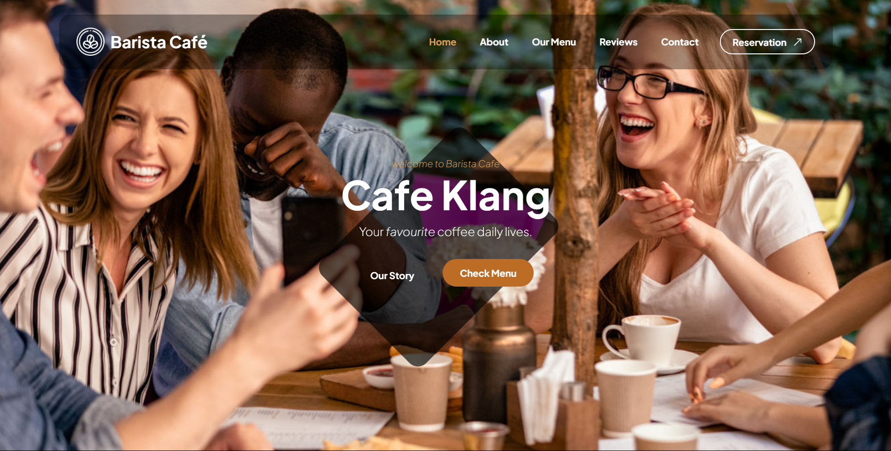
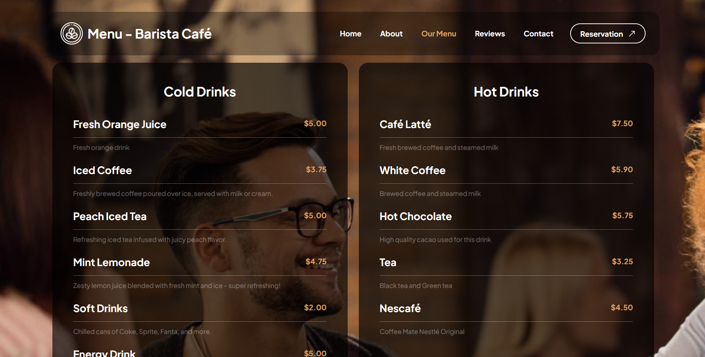
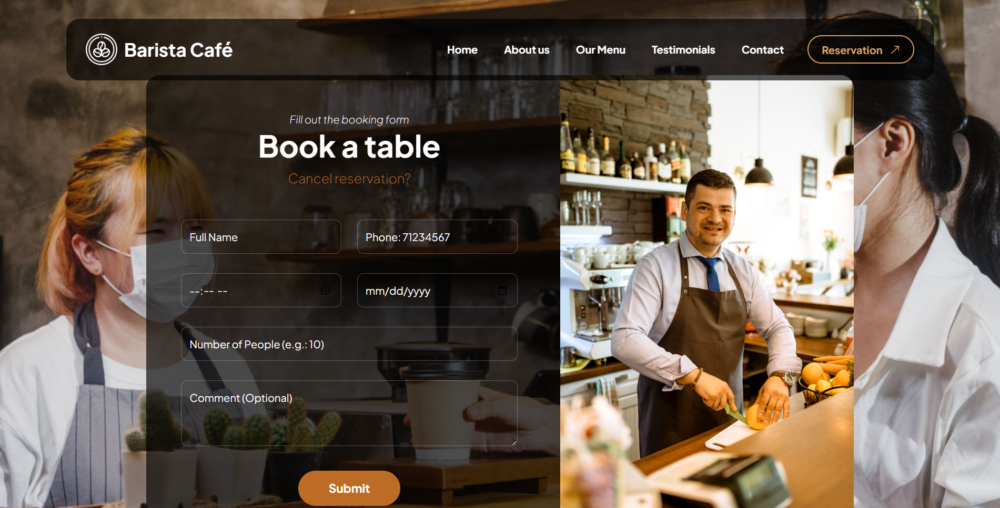

# Cafe_Website 

This website has been built for the cafe or restaurent stores. 
In this website, user can check the menu of the restaurent, then he can take a reservation for a table at a specific time and date. 
The menu can be built as a scan barcode and give the barcode for the clients to scan and check menu for orders. 

They are 4 role distincts can access this website: client(reservation and menu only), admin(login, and more info in readme.md file in admin folder), callcenter(login, and more info in readme.md file in callcenter folder) and the waiter(login, and more info in readme.md file in waiter folder).

Each user has his own responsibilities and work as his access given for him.
Check the images, then readme.md files in each folder. 

You can check the website live view at https://baristacafe.ct.ws

