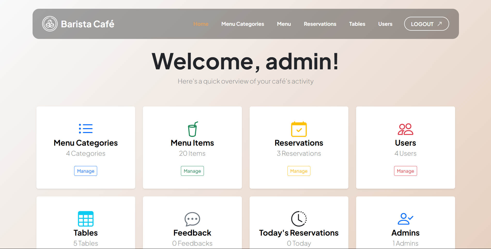
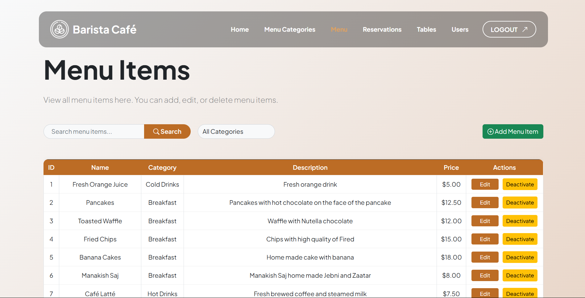
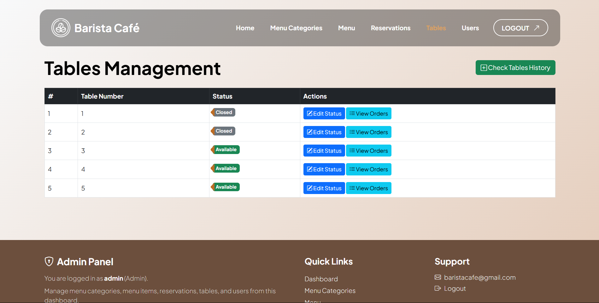

About the admin side, the admin is the function of the website. 
What admin can do?

1- Create new categories menu (like cold drinks, hot drinks,...)

2- Create new menu items (like coffee,...)

3- Add/Check/Modify reservations list.

4- Assign the reservations for tables.

5- Add/Modify tables.

6- About the table, the tables are entered to the system, have number of seats and number of table and status (occupied, close, open); then each table can be used many times after beeing closed.

7- The admin can check orders of each table.

8- Add new users (call center and waiters) and can deactivate their accounts.

