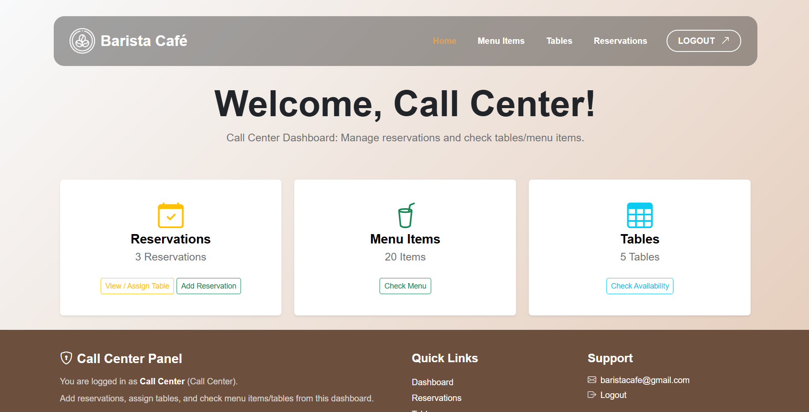

What can callcenter do?
The call center take action of calls from the guests, then add new reservations for them.

1- Check the tables status and number of seats (cannot add or modify)

2- Check menu items that can be filtered by searching. (cannot add or modify)

3- Check reservation list, and can modify the information of it.

4- Add new reservation and assign the reservation for a table (exp: give the reservation of Mahdi to table nb 4).

