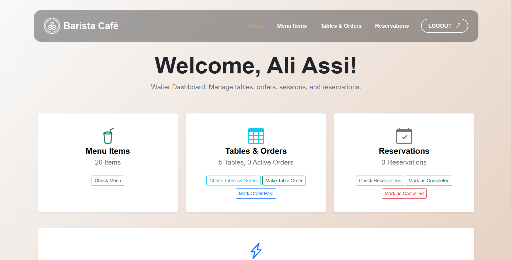
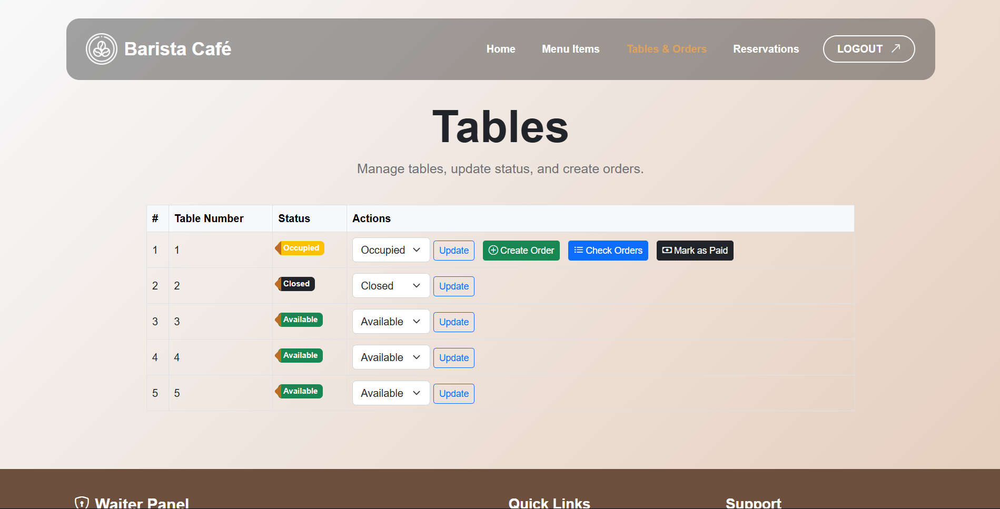

What can waiter do?
1- Check the menu items (can't add or modify)

2- Check Reservations list

3- Modify the reservation list, can only update the status.

4- Create table orders, can add many orders to the same table. 

5- Close the table and mark it as paid. 

6- Check the table orders before getting paid.

